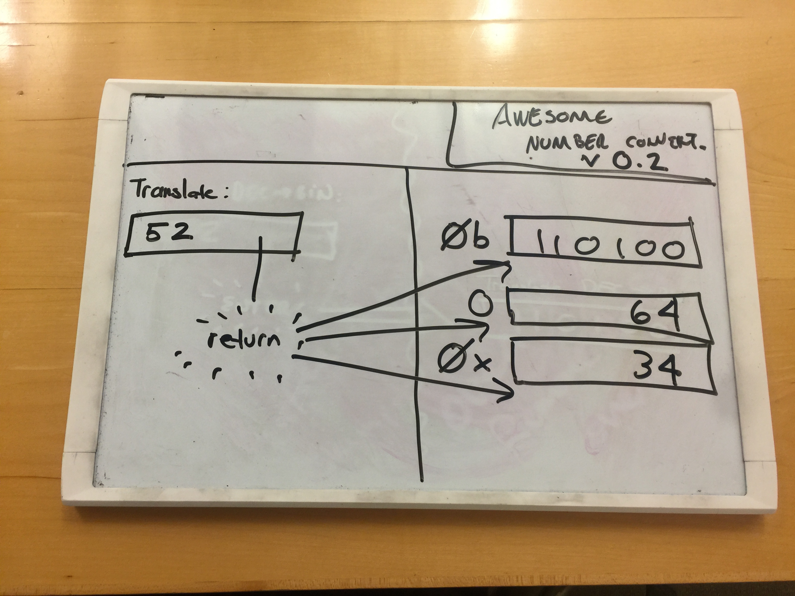

# Translator Widget in React

## Learning Objectives

* Task 1: Install and use a global NPM package: `create-react-app`
* Task 2: Name steps in mockup, static, `React.Component` design strategy
* Task 3: Identify atomic `React.Component`(s) from a mockup and create
* Task 4: Establish centralized, unidirectional data flow for communication between `React.Component` thus "composing" them

## Summary

After finishing your hard work yesterday, your CEO sent you an urgent text from
SOMAdForGalbi networking and Korean food happy hour:

`REACT IS the THIGN! Must use it!`

While you know that frameworks come and go and market demand is _actually_ what
makes companies wealthy, you're game and are going to rewrite the number base
converter app in React.

The mockup is the same, but use React to accomplish it.

## Releases

### Release 0: Build Your Environment using `create-react-app`

### Release 1: Build a Static Version

You can refer to the static version you created yesterday

### Release 2: Build Your Components With Static Data

Configure your page such that, on load, your React Components are "owning"
rendering into the DOM. No interaction should be present. At the end of this
release you should have placeholder data in for all your Components.

### Release 3: "Pull Up" the shared state

Implement a reasonably-named parent Component that holds the shared state. Make
sure it "passes down" event handlers to the children.

#### Conclusion

If you've been following along, you should feel as though a weight has been
lifted from your sholders. React should be accelerating your productivity. But
you should also see that React isn't doing anything you couldn't do from native
JavaScript. This is where you want to be with all frameworks you adopt: you see
the problems they attack, you see their style of solution (if not all the
details!), and are ready to use them. This is the sweet spot!
